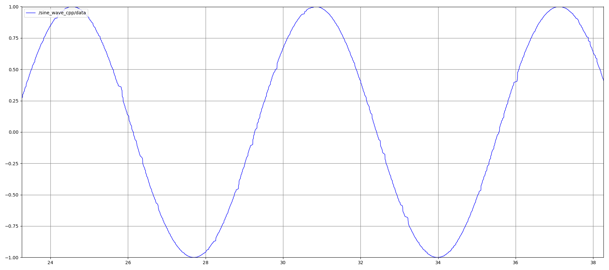
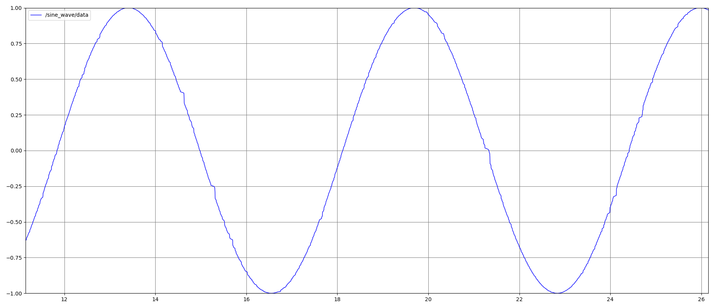

# Tasks for ROS2 Intern Developer Interview at Next Generation Robotics BMW

These tasks has been done by Cuong Chu Tan (cuongchutan@gmail.com) to apply for the intern position.

## List of tasks

0. [Preparations](#preparations)
1. [Publisher/Subscriber](#publishersubscriber)
   - [Creation of a ROS2 publisher node](#creation-of-a-ros2-publisher-node)
     - [C++](#cpp)
     - [Python](#python)
   - [Creation of a ROS2 subscriber node](#creation-of-a-ros2-subscriber-node)
     - [C++](#cpp-1)
     - [Python](#python-1)
   - [Generate parameter library](#generate-parameter-library)
   - [Launch files](#launch-files)
     - [C++](#cpp-2)
     - [Python](#python-2)
   - [Visualization of the sine wave](#visualization-of-the-sine-wave)
     - [C++](#cpp-3)
     - [Python](#python-3)
2. [Service](#service)
   - [Extending the publisher and subscriber](#extending-the-publisher-and-subscriber)
     - [C++](#cpp-4)
     - [Python](#python-4)
   - [How to see the converted image](#how-to-see-the-converted-image)
3. [(Extra) Dockerfile](#extra-dockerfile)
4. [Evaluation Criteria](#evaluation-criteria)
   - [GitHub actions are building the repo](#github-actions-are-building-the-repo)
   - [GitHub actions apply linting and formatting rules](#github-actions-apply-linting-and-formatting-rules)
   - [Unit tests (Python)](#unit-tests-python)
   - [Error Handling](#error-handling)


## Preparations

These tasks has been tested with **Python** *3.12.3* and **ROS2 Jazzy** in **WSL** (*Ubuntu 24.04.1 LTS*).

To examine these tasks, you first have to clone my repository to your local machine: 

```bash
  cd /path/to/your/workspace
  cd src
  git clone https://github.com/cuongchutan/sine_wave_ros2.git
  git clone https://github.com/PickNikRobotics/generate_parameter_library.git 
```

There should be 3 packages in your src directory now: ***generate_parameter_library***, ***grayscale_image***, ***sine_wave***. Make sure that these packages are in this path `workspace/src/`

Now, let's install all the necessary dependencies and build these packages:
```bash
  cd ..
  sudo apt install python3-rosdep
  sudo apt update
  sudo rosdep init
  rosdep update
  rosdep install --from-paths src --ignore-src -r -y
  pip3 install -r src/sine_wave/requirements.txt
  colcon build
```

Then you need to source the install setup in every new terminal:
```bash
  source /path/to/your/workspace/install/setup.bash
```
or add that line into **.bashrc** file (can be found at ~/). 
Don't forget to change `/path/to/your/workspace` to your real workspace.

After the packages has been built successfully, let's examine the tasks in details!
## Publisher/Subscriber

### Creation of a ROS2 publisher node
**Task**: Create a ROS2 node that publishes the value of a sine wave on a topic at a given frequency.

The node parses the following parameters from a yaml file:
- Publisher frequency
- Amplitude
- Angular frequency
- Phase

#### C++
The node is created in the package ***sine_wave*** in the file `src/sine_wave_publisher_cpp.cpp`.

It will create a topic `sine_wave_cpp` that publishes a value for a sine wave at a time:

$$SineValue = Amplitude  \cdot  \sin(AngularFrequency \cdot time + phase)$$

This node can run with the command:
```
  ros2 run sine_wave sine_wave_publisher_cpp
``` 

#### Python
The node is created in the package ***sine_wave*** in the file `sine_wave/sine_wave_publisher.py`.

It will create a topic `sine_wave` that publishes a value for a sine wave at a time. The formular is the same as in C++

This node can run with the command:
```
  ros2 run sine_wave sine_wave_publisher.py
``` 


### Creation of a ROS2 subscriber node
**Task**: Create a ROS2 node that subscribes to the publisher's topic and log the value.

#### C++
The node is created in the package ***sine_wave*** in the file `src/sine_wave_subscriber_cpp.cpp`.

It will subscribe to the topic `sine_wave_cpp` and log the published data, which is the value of the sine wave at a time.

This node can run with the command:
```
  ros2 run sine_wave sine_wave_subscriber_cpp
``` 

#### Python
The node is created in the package ***sine_wave*** in the file `sine_wave/sine_wave_subscriber.py`.

It will subscribe to the topic `sine_wave` and log the published data, which is the value of the sine wave at a time.

This node can run with the command:
```
  ros2 run sine_wave sine_wave_subscriber.py
``` 


### Generate parameter library
**Task**: The nodes should be configured using the `generate_parameter_library` (https://github.com/PickNikRobotics/generate_parameter_library)


--> The publisher node parses the parameters from the yaml file `params.yaml` at `workspace/src/sine_wave/config/`:
```
  sine_wave:
      publisher_frequency:
          type: double
          default_value: 100.0
          read_only: True
          description: "The frequency to publish data of the Publisher" 
      amplitude:
          type: double
          default_value: 1.0
          read_only: True
          description: "The amplitude of a sine wave" 
      angular_frequency:
          type: double
          default_value: 1.0
          read_only: True
          description: "The angular frequency of a sine wave" 
      phase:
          type: double
          default_value: 0.0
          read_only: True
          description: "The initial phase of a sine wave" 
```
According to this library, `sine_wave` is the namespace of these parameters. Each parameter must have a mandatory attribute `type` (in this case, they are all `double`)

While running the publisher node `ros2 run sine_wave sine_wave_publisher_cpp`, you can open a new terminal and observe all parameters by running `ros2 param list`. It will show something similar to:
```
  /sine_wave_publisher_cpp:
      amplitude
      angular_frequency
      phase
      publisher_frequency
      qos_overrides./parameter_events.publisher.depth
      qos_overrides./parameter_events.publisher.durability
      qos_overrides./parameter_events.publisher.history
      qos_overrides./parameter_events.publisher.reliability
      start_type_description_service
      use_sim_time

```
Now you can validate the implementation of this library for a parameter by running `ros2 param describe /sine_wave_publisher_cpp angular_frequency` and the output should be:
```
  Parameter name: angular_frequency
      Type: double
      Description: The angular frequency of a sine wave
      Constraints:
          Read only: true

```


### Launch files
**Task**: Create launch files for the nodes.

#### C++
The launch file for C++ is created in the package ***sine_wave*** at `launch/sine_wave_cpp_launch.py`.

It will run both the publisher node `sine_wave_publisher_cpp` and the subscriber node `sine_wave_subscriber_cpp`.

This launch file can run with the command:
```
  ros2 launch sine_wave sine_wave_cpp_launch.py
``` 
You can also check the running nodes by executing in a new terminal:
```
  ros2 topic info -v /sine_wave_cpp
```
It should appear 2 nodes, one `sine_wave_publisher_cpp` for the publisher and the other `sine_wave_subscriber_cpp` for the subscriber.

#### Python
The launch file for Python is created in the package ***sine_wave*** at `launch/sine_wave_launch.py`.

It will run both the publisher node `sine_wave_publisher.py` and the subscriber node `sine_wave_subscriber.py`.

This launch file can run with the command:
```
  ros2 launch sine_wave sine_wave_launch.py
``` 
You can also check the running nodes by executing in a new terminal:
```
  ros2 topic info -v /sine_wave
```
It should appear 2 nodes, one `sine_wave_publisher` for the publisher and the other `sine_wave_subscriber` for the subscriber.


### Visualization of the sine wave
**Task**: Show how to visualize the sine wave.

--> It is recommended to install `rqt-plot` to visualize the plots for the sine waves:
```
  sudo apt-get install ros-jazzy-rqt ros-jazzy-rqt-plot
```

#### C++
While launching using the launch file in previous section, you can open a new terminal and run:
```
  rqt
```
A new window will pop up for user to select different ways to visualize data. In these tasks, it's great to show the sine wave in a plot.

It's also important to select `sine_wave_cpp/data` to visualize the output:



#### Python
It's similar to C++, but you need to select `sine_wave/data` to get the result:




## Service

### Extending the publisher and subscriber
**Task**: Extend the previously created nodes by adding a custom service. This service receives as input the file path of an image and returns the same image but in grayscale

--> The service is implemented in the package ***grayscale_image*** that we have built previously. The `grayscale_image/srv/ConvertToGrayscale` contains:
```
  string file_path
  ---
  string grayscale_file_path
```

#### C++
We will extend the Publisher node with a custom Service `grayscale_srv_cpp` calling to ConvertToGrayscale, and the Subscriber node with a Client for the Service. 

This service will convert the image into grayscale using OpenCV libraray `cv2`, and then save the converted image at `grayscale_file_path/`.

#### Python
Similar to C++, but the service's name is `grayscale_srv` and the saved path is slightly different.


### How to see the converted image
The service should convert this image into grayscale:


While running the launch files, you might notice that the converted image is saved at a specific location. Go to `workspace/install/sine_wave/share/sine_wave/image`, and you can observe the converted image `grayscale_image.png` for Python service and `grayscale_image_cpp.png` for C++ service.


## (Extra) Dockerfile

I unfortunately don't have much experience on Docker. Even though, I have the gist of what I should do, and provide a `Dockerfile` that try to build and run the project from within the docker.

In order to build the docker, go into the `workspace/src/` directory and run:
```
  docker build -t ros2_sine_wave .
```
where `-t ros2_sine_wave` tags the docker image with the name `ros2_sine_wave`, and `.` indicates that the Dockerfile is in the current directory.

Afterwards, we can test if the image runs as expected by running the container from the image:
```
  docker run -it ros2_sine_wave
```
However, since the docker is still not fully built, further validation will be tested in the future.
## Evaluation Criteria

### GitHub actions are building the repo
In my repository, the GitHub actions for builing the repo is provided with the file `.git/workflows/build.yml`.

Go to my GitHub repository https://github.com/cuongchutan/sine_wave_ros2, in the "Actions" tab, you will see a list of workflow runs. Click on the workflow `build` to inspect.

Unfortunately, the workflow is not fully passed.


### GitHub actions apply linting and formatting rules
In my repository, the GitHub actions for builing the repo is provided with the file `.git/workflows/lint_and_format.yml`.

Go to my GitHub repository https://github.com/cuongchutan/sine_wave_ros2, in the "Actions" tab, you will see a list of workflow runs. Click on the workflow `lint_and_format` to inspect.

Unfortunately, the workflow is not fully passed.

### Unit tests (Python)
Due to many errors while building the unit tests for C++ in `CMakeLists.txt`, only unit tests for Python are currently available. These Python tests require `pytest` to be install:
```
  pip3 install pytest
```
These tests are available at `workspace/src/sine_wave/tests/`. The test `test_publisher.py` focuses on validating the published data, while the test `test_subscriber.py` checks if the subscriber log the correct data from a random message. To perform these unit tests, you can execute:
```
  cd /path/to/your/workspace/src/sine_wave/tests
  python3 -m unittest test_publisher.py
  python3 -m unittest test_subscriber.py
```
The output should be all OK!


### Error Handling
1. If it shows an error relevant to the package ***sine_wave*** depends on ***grayscale_image***, you should build the package ***grayscale_image*** first:
```bash
  colcon build --packages-select grayscale_image
  colcon build
```
2. If you encounter problems *This environment is externally managed ...* while installing dependencies using `pip`, it is recommeded to create a virtual environment and install the dependencies inside that.
3. If you insert an empty demo image (e.g. due to wrong path), there will be a warning `Failed to read image from ...` in the logger.
4. If the client is waiting too long for a service (e.g. due to non-exist or wrong name), there will be a warning `Service is not available`.